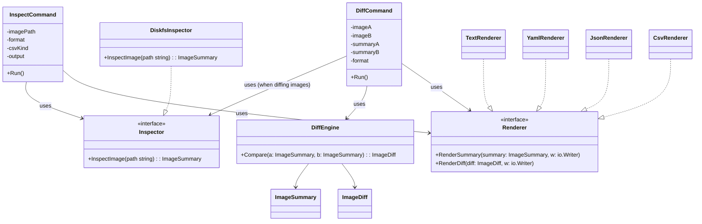

# ADR: Support Image Inspection and Image Comparison

**Status**: Proposed  
**Date**: 2026-01-07  
**Updated**: 2026-01-14  
**Authors**: OS Image Composer Team  
**Technical Area**: Image Analysis / Image Introspection

---

## Summary

This ADR proposes adding first-class support for **image inspection** and
**image comparison** to the OS Image Composer.

The feature enables users to:
- Inspect a pre-generated raw disk image and extract structured information
  about its partition layout, boot configuration, kernel, and user-space
  components.
- Compare two images at different semantic levels and render the results into
  a machine-consumable report format of their choice.

The goal is to make image analysis **fast, consistent, and automatable**, without
requiring users to manually mount images or chain together low-level tooling.

---

## Context

### Problem Statement

Users of OS Image Composer often need to understand or validate images they have
already created. Common questions include:

- What partition table does this image use?
- How many partitions does it contain, and what are their types, sizes, and flags?
- What bootloader and boot configuration are present?
- Which kernel version and kernel parameters are used?
- What user-space packages (SBOM) are included?
- What additional system configuration or policy is embedded?

Today, answering these questions requires manually mounting images and invoking
a variety of Linux command-line tools (e.g., `lsblk`, `fdisk`, `mount`,
package managers, boot configuration utilities). This approach presents several
challenges:

- High cognitive load and poor user experience
- Tooling varies across host environments
- Output is ad hoc and difficult to automate or persist
- Comparing two images reliably is labor-intensive and error-prone

Image comparison is particularly challenging: two images may appear identical
functionally while differing in subtle but important ways (layout, signing,
kernel parameters, or package versions).

---

### Background

Users may want to:
- Inspect an image generated by OS Image Composer
- Compare multiple images generated by the same pipeline
- Compare an image created by OS Image Composer against one created elsewhere

This feature is intended to be **image-format agnostic** and operate directly
against raw disk images, without assumptions about how they were produced.

---

## Decision / Recommendation

We will introduce dedicated **inspect** and **diff** capabilities to the
OS Image Composer CLI.

The implementation should minimize reliance on host-specific Linux syscalls and
favor **portable, well-maintained Go libraries** (e.g., `go-diskfs`) to ensure
consistent behavior across environments and improved long-term maintainability.

---

## Core Design Principles

1. **Explicit Commands**  
   Use Cobra to introduce clear, discoverable commands:
   - `inspect`: extract structured metadata from one or more images
   - `diff`: compare two images based on inspected metadata

2. **Separation of Concerns**  
   - Inspection logic produces a normalized, in-memory representation of an image.
   - Diff logic operates solely on these representations and is independent of
     how the data was collected.

3. **Renderer Abstraction**  
   - Output rendering is decoupled from business logic.
   - Multiple formats (`yml`, `json`, `csv`, etc.) are supported via a common
     renderer interface.

4. **Meaningful Similarity Levels**  
   - Comparisons are grouped into well-defined similarity levels that reflect
     user intent, from strict binary equality to higher-level semantic equivalence.

---

## Command Line Interface

The OS Image Composer CLI will be extended with additional commands:

```bash
os-image-composer inspect <image.img> \
  --format=yml \
  --output=report.yml \
  --verbose

  
os-image-composer diff <image-1.img> <image-2.img> \
  --format=yml \
  --output=report.yml \
  --verbose

```

The CLI model allows future extension to:

- Inspect multiple images in a single invocation
- Compare more than two images without modifying core command semantics

## Rendering Targets

Initially, output will be limited to a single rendering target (e.g., YAML) in
order to reduce complexity. The design allows future extension to support:

- JSON, for automation and API integration
- CSV, for spreadsheet-driven workflows
- Additional formats as required

Each renderer implements a shared interface and consumes the same normalized
inspection or comparison data.

## Inspection and Comparison Model

Inspection and comparison are intentionally decoupled:

- Inspection produces a complete, structured description of a single image.
- Comparison consumes inspection results and produces a diff report.

This separation enables reuse of inspection data, caching, and future expansion
without complicating the image parsing logic.

The initial implementation targets comparison of two images, but the underlying
model supports N-way comparison.

## Similarity Levels

Image comparisons are classified into discrete similarity levels that describe
how closely two images match.

### Binary Identical

Images are byte-for-byte identical.

- Comparison is performed using a SHA-256 digest over the entire image.
- This is expected to be rare due to signing, metadata variability, and layout
differences.

### Semantically Identical

Images differ at the binary level but are functionally equivalent.

**Partition Layout**

- Same partition table type (MBR or GPT)
- Same number of partitions
- For each partition:
   - Same type
   - Same start LBA
   - Same size (within a configurable tolerance)

**Kernel**

- Same default kernel version
- Equivalent kernel command line (normalized to ignore known noisy parameters)

**Boot Configuration**

- Same bootloader type(s) (e.g., grub2, systemd-boot)
- Equivalent Secure Boot characteristics (e.g., presence of shim)

**SBOM**

- SBOM present in both images
- Identical SBOM checksum or equivalent package set

### Layout Identical

Partition layout is identical, but one or more higher-level components differ:

- Kernel version
- Kernel command line
- Boot configuration
- SBOM or package set

### Different

Fallback category when images do not meet any of the similarity criteria above.

## Consequences and Trade-offs

**Pros**

- Significantly improved UX for inspection and comparison workflows
- Consistent, automatable output
- Reduced dependency on host-specific tooling
- Strong foundation for CI/CD image validation

**Cons**

- Initial scope does not include image modification
- Normalization and tolerance rules introduce some complexity
- Semantic equivalence is inherently opinionated and may require iteration

## Non-Goals

- Modifying images during inspection or comparison
- Inspecting live or running systems
- Supporting non-raw image formats in the initial implementation

## Components



## Relevant Data Structures

The following outlines the conceptual data structures required for image
inspection and comparison.

### ImageSummary

Represents the complete inspection result for a single image:

```go
type ImageSummary struct {
    Path           string         `json:"path"`
    Hash           string         `json:"hash"`
    HashAlgo       string         `json:"hashAlgo"` // "sha256"
    Size           int64          `json:"size"`
    PartitionTable PartitionTable `json:"partitionTable"`
    Kernel         KernelInfo     `json:"kernel"`
    Boot           BootInfo       `json:"boot"`
    SBOM           SBOMInfo       `json:"sbom,omitempty"`
}

type PartitionTable struct {
    Type       string      `json:"type"` // "gpt" or "mbr"
    Partitions []Partition `json:"partitions"`
}

type Partition struct {
    Number   int    `json:"number"`
    Type     string `json:"type"`
    StartLBA uint64 `json:"startLBA"`
    Size     uint64 `json:"size"`
    Label    string `json:"label,omitempty"`
    UUID     string `json:"uuid,omitempty"`
}

type KernelInfo struct {
    Version     string `json:"version"`
    CommandLine string `json:"commandLine"`
}

type BootInfo struct {
    Bootloader  string `json:"bootloader"` // "grub2", "systemd-boot"
    SecureBoot  bool   `json:"secureBoot"`
    ShimPresent bool   `json:"shimPresent"`
}

type SBOMInfo struct {
    Present  bool     `json:"present"`
    Path     string   `json:"path,omitempty"`
    Checksum string   `json:"checksum,omitempty"`
    Packages []string `json:"packages,omitempty"`
}
```

### ImageDiff

Represents the comparison result between two images:

```go
type ImageDiff struct {
    Equal         bool                `json:"equal"`
    Level         string              `json:"level"` // "binary-identical", "semantic-identical", "layout-identical", "different"`
    Binary        BinaryDiff          `json:"binary"`
    PartitionTable PartitionTableDiff `json:"partitionTable"`
    Kernel        KernelDiff          `json:"kernel"`
    Boot          BootDiff            `json:"boot"`
    SBOM          SBOMDiff            `json:"sbom"`
    HashAlgo      string              `json:"hashAlgo,omitempty"` // "sha256"
    Hashes        []string            `json:"hashes,omitempty"` // [hashA, hashB]
    Notes         []string            `json:"notes,omitempty"`
}
```

### Similarity Classification Logic

```go
// Trivial heuristics can be used to check each of the evaluated items to 
// classify them into one of the pre-defined categories.
switch {
    case diff.Binary.Equal:
        diff.Level = "binary-identical"
    case layoutEqual && kernelEqual && bootEqual && sbomEqual:
        diff.Level = "semantic-identical"
    case layoutEqual:
        diff.Level = "layout-identical"
    default:
        diff.Level = "different"
    }

```

## Error Handling

The inspect and diff commands must handle various error conditions gracefully:

| Error Condition | Behavior |
|-----------------|----------|
| Image file not found | Return error with clear message |
| Image file unreadable (permissions) | Return error with suggestion to check permissions |
| Corrupted or truncated image | Return error indicating file may be corrupted |
| Unrecognized partition table | Report as "unknown" in output, continue inspection |
| Filesystem mount failure | Skip filesystem-level inspection, report in notes |
| SBOM not present in image | Set `sbom.present = false`, continue without error |
| Unsupported image format | Return error listing supported formats |

### Verbose Mode

When `--verbose` is specified:
- Log each inspection phase as it executes
- Include timing information for performance analysis
- Show detailed error context for troubleshooting
- Display intermediate results during comparison
