# ADR: Template-Enriched RAG for AI-Powered Template Generation

**Status**: Proposed  
**Date**: 2026-01-05  
**Updated**: 2026-01-05  
**Authors**: OS Image Composer Team  
**Technical Area**: AI/ML, Template Generation

---

## Summary

This ADR proposes a Template-Enriched RAG (Retrieval-Augmented Generation) architecture for AI-powered OS image template generation. The design embeds semantic metadata directly within template files, enabling self-describing templates that can be effectively indexed and retrieved using natural language queries. Users can interact conversationally to generate and iteratively refine templates through natural language.

---

## Context

### Problem Statement

OS Image Composer needs an AI-powered system that generates production-ready YAML templates from natural language descriptions. The system must:

1. Ground responses in real, working template examples to reduce hallucination
2. Apply curated best practices (packages, kernel configs, disk layouts) consistently
3. Support multiple AI providers (Ollama, OpenAI) with different embedding dimensions
4. Provide fast, accurate retrieval with minimal latency
5. Be maintainable and easy to extend
6. **Allow iterative refinement through conversation**

### Background

The system's knowledge is captured in **Template Examples** (`image-templates/*.yml`): Real, working YAML templates with actual package lists, kernel configurations, and disk layouts.

To enable effective semantic search and retrieval, templates are enhanced with embedded metadata that describes their purpose, use cases, and relevant keywords. This self-describing approach allows templates to be indexed and matched against natural language queries without requiring external metadata files.

As the template library grows, new templates for different use cases naturally expand the system's capabilities without additional configuration.

---

## Recommendation

### Recommended Approach: Template-Enriched RAG with Hybrid Scoring

We recommend implementing templates with embedded metadata that enables effective semantic indexing and retrieval. Each template becomes self-describing, containing keywords, use case information, and descriptive text that enhances discoverability.

### Core Design Principles

1. **Self-Describing Templates**: Each template contains its own metadata for semantic matching
2. **Single Search Path**: One semantic search across all enriched templates
3. **Hybrid Scoring**: Combine semantic similarity with keyword and package overlap for robust ranking
4. **Organic Growth**: Adding new templates automatically expands system capabilities
5. **Conversational Refinement**: Users can iterate on generated templates through natural dialogue

---

## Template Metadata Schema

Templates include an optional `metadata` section that enhances searchability:

```yaml
# Example: elxr-cloud-amd64.yml
metadata:
  useCase: cloud-deployment
  description: "Cloud-ready eLxr image for VM deployment on AWS, Azure, GCP"
  keywords:
    - cloud
    - cloud-init
    - aws
    - azure
    - gcp
    - vm
  capabilities:
    - security
    - monitoring
  recommendedFor:
    - "cloud VM deployment"
    - "auto-scaling environments"

image:
  name: elxr-cloud-amd64
  version: "12.12.0"

target:
  os: wind-river-elxr
  dist: elxr12
  arch: x86_64
  imageType: raw
# ... rest of template configuration
```

### Metadata Fields

| Field | Required | Description |
|-------|----------|-------------|
| `useCase` | No | Primary use case category (e.g., cloud-deployment, edge, minimal) |
| `description` | No | Human-readable description for semantic matching |
| `keywords` | No | List of terms that help match user queries |
| `capabilities` | No | Feature tags (security, monitoring, performance) |
| `recommendedFor` | No | Natural language descriptions of ideal use cases |

Templates without metadata remain searchable using their structural content (name, packages, distribution).

---

## Diagram Conventions

All diagrams in this ADR use a consistent color scheme:

| Color | Component Type | Fill | Stroke | Examples |
|-------|---------------|------|--------|----------|
| ⚪ Slate | User Interface / Input | `#ECEFF1` | `#607D8B` | CLI, User Query, User Message |
| 🔵 Deep Blue | AI / LLM Operations | `#E3F2FD` | `#1565C0` | Embedding API, LLM, Generate |
| 🟣 Purple | Classification / Analysis | `#F3E5F5` | `#9C27B0` | Query Classifier, Analyze Tokens |
| 🟢 Green | RAG / Retrieval / Success | `#E8F5E9` | `#4CAF50` | RAG Engine, Hybrid Scoring, Valid Output |
| 🟠 Orange | Agent / Cache / Decisions | `#FFF3E0` | `#FF9800` | Agent Loop, Cache, Conditionals |
| 🟡 Yellow | Warnings | `#FFF9C4` | `#FBC02D` | Return with Warnings |
| 🔴 Red-Orange | Errors / Fixes | `#FFCCBC` | `#FF5722` | Fix Errors, Validation Failed |

---

## High-Level Architecture


### Component Descriptions

| Component | Responsibility |
|-----------|---------------|
| **Session Manager** | Maintains conversation state, chat history |
| **Query Classifier** | Detects query type (semantic, package-explicit, refinement, negation) |
| **RAG Engine** | Semantic search with hybrid scoring (semantic + keyword + package) |
| **Agent Loop** | Orchestrates LLM generation → validation → fix cycle |
| **Agent Tools** | Functions that call existing os-image-composer code (not separate services) |

---

## Data Flow

### Indexing Flow (Startup)


### Query Flow (Single Turn)


### Conversational Flow (Multi-Turn)


---

## Design Details

### Query Classification

The system classifies incoming queries to apply appropriate scoring weights and handling strategies. This enables the system to adapt its behavior based on query characteristics.

#### Query Types

| Type | Description | Example | Scoring Adjustment |
|------|-------------|---------|-------------------|
| **Semantic** | Natural language describing intent | "I need a cloud image for AWS" | Default weights |
| **Package-Explicit** | Query mentions specific packages | "image with nginx and docker-ce" | Boost package score |
| **Keyword-Heavy** | Query uses specific technical terms | "edge IoT minimal raw" | Boost keyword score |
| **Refinement** | Modifying existing template | "add monitoring packages" | Skip RAG, use session |
| **Negation** | Excludes certain features | "minimal without docker" | Apply exclusion filter |

#### Classification Logic

```mermaid
flowchart TD
    A[Input Query] --> B{Has Session<br/>Context?}
    B -->|Yes| C{Modification<br/>Intent?}
    B -->|No| D[Analyze Query Tokens]
    
    C -->|Yes| E[Refinement Type]
    C -->|No| D
    
    D --> F{Package Names<br/>Detected?}
    F -->|≥2 packages| G[Package-Explicit Type]
    F -->|<2 packages| H{Negation<br/>Keywords?}
    
    H -->|Yes| I[Negation Type]
    H -->|No| J{Technical<br/>Keywords?}
    
    J -->|High density| K[Keyword-Heavy Type]
    J -->|Low density| L[Semantic Type]

    style A fill:#ECEFF1,stroke:#607D8B
    style B fill:#FFF3E0,stroke:#FF9800
    style C fill:#FFF3E0,stroke:#FF9800
    style D fill:#F3E5F5,stroke:#9C27B0
    style E fill:#E8F5E9,stroke:#4CAF50
    style F fill:#FFF3E0,stroke:#FF9800
    style G fill:#E8F5E9,stroke:#4CAF50
    style H fill:#FFF3E0,stroke:#FF9800
    style I fill:#FFCCBC,stroke:#FF5722
    style J fill:#FFF3E0,stroke:#FF9800
    style K fill:#E8F5E9,stroke:#4CAF50
    style L fill:#E8F5E9,stroke:#4CAF50
```



#### Scoring Weight Profiles

```yaml
scoring_profiles:
  semantic:        # Default
    semantic: 0.70
    keyword: 0.20
    package: 0.10
    
  package_explicit:
    semantic: 0.40
    keyword: 0.20
    package: 0.40
    
  keyword_heavy:
    semantic: 0.50
    keyword: 0.40
    package: 0.10
```

#### Negation Handling

When negation keywords are detected ("without", "no", "exclude"), the system:

1. Extracts terms following negation keywords
2. Maps terms to package names where possible
3. Applies penalty to templates containing excluded items

```
Query: "minimal edge image without docker"
Extracted: negative_terms = ["docker"]
Action: Penalize templates where packages contain "docker*"
```

### Searchable Text Construction

For each template, a searchable text is constructed by combining structural content with embedded metadata.

> **Note**: The system uses two different approaches for different purposes:
> - **Cache hash**: Computed from the **entire file** (SHA256) - ensures any change triggers re-embedding
> - **Searchable text**: Constructed from **selected fields** - optimized for semantic search quality
>
> We don't embed raw YAML syntax (brackets, indentation, anchors). Instead, we construct human-readable text that captures semantic meaning, which produces better embedding vectors for similarity search.

**From Template Structure:**
- Template filename and image name
- Distribution, architecture, image type
- Package lists from systemConfig
- Kernel configuration details

**From Embedded Metadata (if present):**
- Use case category
- Description text
- Keywords list
- Capabilities tags

**Example Searchable Text:**

```
Template: elxr-cloud-amd64.yml
Name: elxr-cloud-amd64
Use case: cloud-deployment
Description: Cloud-ready eLxr image for VM deployment
Distribution: elxr12
Architecture: x86_64
Image type: raw
Keywords: cloud, cloud-init, aws, azure, gcp
Packages: cloud-init, docker-ce, openssh-server
```

### Fallback for Templates Without Metadata

Templates without an explicit `metadata` section remain fully functional:

| Source | Inferred Information |
|--------|---------------------|
| Filename | Keywords from name parts (e.g., "cloud", "minimal", "edge") |
| Packages | Use case hints (docker → container, nginx → web-server) |
| Distribution | OS family keywords |
| Image Type | Deployment context (raw, iso, initrd) |

### Hybrid Scoring Algorithm

The hybrid scoring combines three signals with weights adjusted by query classification:

| Signal | Default Weight | Description |
|--------|----------------|-------------|
| **Semantic Similarity** | 70% | Cosine similarity between query and template embeddings |
| **Keyword Overlap** | 20% | Overlap between query tokens and template keywords |
| **Package Mentions** | 10% | Ratio of query-mentioned packages found in template |

**Combined Score Formula:**

```
Score = (Ws × SemanticScore) + (Wk × KeywordScore) + (Wp × PackageScore) - NegationPenalty
```

Where weights (Ws, Wk, Wp) are determined by query classification.

### Embedding Cache Strategy

The system caches embeddings to avoid redundant API calls and improve startup time.

#### Why Cache Embeddings?

An **embedding** is a vector (list of numbers) that represents the semantic meaning of text:

```
Template: "Cloud-ready eLxr image for AWS deployment"
                            │
                            ▼
                    ┌───────────────┐
                    │  Ollama API   │
                    │ nomic-embed   │
                    └───────────────┘
                            │
                            ▼
Embedding: [0.234, -0.891, 0.445, 0.122, ..., 0.667]
           └──────────────────────────────────────┘
                        768 numbers (~3KB)
```

**Without caching**, every startup requires API calls for all templates:

```
50 templates × 100ms per embedding = 5 seconds startup time (every run!)
```

**With caching**, embeddings are computed once and reused:

```
First run:  Generate all embeddings → Store in cache → 5 seconds
Later runs: Load from disk cache → ~50ms total ✓
```

#### Cache Design


#### Cache Directory Structure

```
.ai-cache/                          # Root cache directory
├── embeddings/
│   ├── index.json                  # Metadata: what's cached, model info
│   └── vectors/                    # Actual embedding binary data
│       ├── a1b2c3d4e5f6.bin       # 768 float32 values = ~3KB per file
│       ├── f7e8d9c0b1a2.bin       # One file per template
│       └── 1234abcd5678.bin
```

#### Cache Index Schema

The `index.json` file tracks all cached embeddings:

```json
{
  "model_id": "nomic-embed-text",
  "dimensions": 768,
  "created_at": "2026-01-02T10:00:00Z",
  "entries": {
    "a1b2c3d4": {
      "template": "elxr-cloud-amd64.yml",
      "content_hash": "a1b2c3d4e5f6...",
      "updated_at": "2026-01-02T10:00:00Z"
    },
    "f7e8d9c0": {
      "template": "emt-edge-minimal.yml",
      "content_hash": "f7e8d9c0b1a2...",
      "updated_at": "2026-01-02T10:05:00Z"
    }
  }
}
```

| Field | Description |
|-------|-------------|
| `model_id` | Embedding model used (e.g., `nomic-embed-text`, `text-embedding-3-small`) |
| `dimensions` | Vector size (model-specific: 768, 1536, or 3072) |
| `entries` | Map of content hash → template metadata |
| `content_hash` | SHA256 of template file (first 16 chars used as key) |

#### Binary Vector File Format

Each `.bin` file contains raw `float32` values:

```
vectors/a1b2c3d4.bin (3,072 bytes for 768-dimension model)
┌─────────────────────────────────────────────────────┐
│ float32 │ float32 │ float32 │ ... │ float32        │
│  0.234  │ -0.891  │  0.445  │ ... │  0.667         │
│ 4 bytes │ 4 bytes │ 4 bytes │     │ 4 bytes        │
└─────────────────────────────────────────────────────┘
         768 values × 4 bytes = 3,072 bytes
```

```go
// Loading a cached embedding
func loadEmbedding(cacheDir, hash string) ([]float32, error) {
    path := filepath.Join(cacheDir, "vectors", hash+".bin")
    data, err := os.ReadFile(path)
    if err != nil {
        return nil, err
    }
    
    // Convert bytes to float32 slice
    embedding := make([]float32, len(data)/4)
    reader := bytes.NewReader(data)
    binary.Read(reader, binary.LittleEndian, &embedding)
    
    return embedding, nil
}
```

#### Cache Lookup Flow

```
1. Read template file
   content = ReadFile("elxr-cloud-amd64.yml")
                              │
                              ▼
2. Compute hash of entire file content (for cache key)
   hash = SHA256(content)[:16] → "a1b2c3d4"
                              │
                              ▼
3. Check index.json
   Does "a1b2c3d4" exist in entries?
   ├─ YES → Check model_id matches current config?
   │        ├─ YES → Cache HIT → Load vectors/a1b2c3d4.bin
   │        └─ NO  → Cache MISS → Regenerate (model changed)
   │
   └─ NO  → Cache MISS:
            a. Parse YAML and extract fields
            b. Construct searchable text (see "Searchable Text Construction")
            c. Generate embedding from searchable text via API
            d. Store in vectors/a1b2c3d4.bin
```

#### Why Check model_id?

Different embedding models produce incompatible vectors:

| Model | Provider | Dimensions | File Size |
|-------|----------|------------|-----------|
| `nomic-embed-text` | Ollama | 768 | ~3 KB |
| `text-embedding-3-small` | OpenAI | 1536 | ~6 KB |
| `text-embedding-3-large` | OpenAI | 3072 | ~12 KB |

**Embeddings from different models cannot be mixed:**

```
Query embedded with OpenAI  →  [0.1, 0.2, ..., 0.9]  (1536 dims)
Template cached with Ollama →  [0.3, 0.4, ..., 0.7]  (768 dims)

Cosine similarity: IMPOSSIBLE (dimension mismatch!)
```

When the configured model changes, the entire cache must be invalidated.

#### Cache Invalidation Rules

| Trigger | Action |
|---------|--------|
| Template content changes | Recompute hash → cache miss → regenerate |
| Embedding model changes | Clear entire cache (model_id mismatch) |
| Cache TTL expires (optional) | Regenerate on next access |
| Manual cache clear | `os-image-composer ai --clear-cache` |

#### Example: Full Cache Flow

```bash
$ os-image-composer ai "create cloud image"
```

```
Step 1: Scan templates in ./image-templates/
        Found: 15 YAML files

Step 2: For each template, check cache:
        
        elxr-cloud-amd64.yml
        ├─ Compute hash: "a1b2c3d4"
        ├─ Check index.json: EXISTS, model matches
        └─ Load: vectors/a1b2c3d4.bin ✓ (HIT)
        
        emt-edge-minimal.yml  
        ├─ Compute hash: "f7e8d9c0"
        ├─ Check index.json: EXISTS, model matches
        └─ Load: vectors/f7e8d9c0.bin ✓ (HIT)
        
        new-template.yml (just added)
        ├─ Compute hash: "99887766"
        ├─ Check index.json: NOT FOUND
        ├─ Call Ollama API → Generate embedding (~100ms)
        └─ Save: vectors/99887766.bin ✓ (MISS, now cached)

Step 3: Build vector index from all embeddings
        
Step 4: Process user query using the index...
```

#### Content Hash Computation

The hash is computed from the **entire template file**. This approach is simpler, more robust, and eliminates the risk of missing fields that affect the embedding.

```go
func computeContentHash(templatePath string) (string, error) {
    content, err := os.ReadFile(templatePath)
    if err != nil {
        return "", err
    }
    hash := sha256.Sum256(content)
    return hex.EncodeToString(hash[:])[:16], nil
}
```

**Why hash the whole file instead of selected fields?**

| Aspect | Whole File | Selected Fields |
|--------|------------|-----------------|
| Simplicity | ✅ Single line | ❌ Must enumerate every field |
| Correctness | ✅ Any change triggers re-embedding | ⚠️ Risk of missing fields |
| Maintenance | ✅ Works with schema changes | ❌ Must update when schema changes |

The minor downside is that non-semantic changes (e.g., comments, whitespace) trigger re-embedding, but this is negligible since re-embedding a single template takes ~100ms with Ollama.

> **Important Distinction**: The whole-file hash is used only for **cache invalidation** (detecting changes). The actual **embedding is generated** from constructed searchable text (selected fields formatted as human-readable text) - not the raw YAML file. See "Searchable Text Construction" section for details.

### Conversational Interaction

Users can interact conversationally to generate and refine templates through natural language.

#### Session Management

Each conversation maintains a session containing:

```go
type Session struct {
    ID              string
    CurrentTemplate *GeneratedTemplate
    History         []Message
    CreatedAt       time.Time
    LastActiveAt    time.Time
}

type Message struct {
    Role    string  // "user" or "assistant"
    Content string
    Template *GeneratedTemplate  // If message produced a template
}
```

#### Interaction Modes

**1. Initial Generation**

```
User: Create a minimal edge image for eLxr with networking support
Assistant: I've generated a minimal edge template based on elxr12-x86_64-edge-raw.
[Shows generated YAML]
Would you like to modify anything?
```

**2. Iterative Refinement**

```
User: Add docker and monitoring packages
Assistant: I've updated the template with docker-ce, containerd.io, and prometheus-node-exporter.
[Shows updated YAML with changes highlighted]
```

**3. Specific Modifications**

```
User: Change the disk size to 8GiB and add a separate /data partition
Assistant: I've updated the disk configuration:
- Root disk: 8GiB (was 4GiB)  
- Added /data partition: 2GiB, ext4
[Shows updated disk section]
```

**4. Explanation and Summary**

```
User: What packages are included? Summarize the template.
Assistant: Here's a summary of your template:
- 23 packages including kernel, systemd, openssh-server...
- Disk: 8GiB with 3 partitions (EFI, root, data)
- Bootloader: systemd-boot with EFI support
```

#### Refinement Flow


> **Note**: Validation and self-correction happen within the Agent Loop. See "Self-Correction Loop" in the Lightweight Agentic Capabilities section for details.

#### Context Building for Refinement

When processing refinement requests, the LLM receives:

```
You are modifying an OS image template. Current template:
---
[Current YAML]
---

User request: "Add monitoring packages"

Instructions:
1. Add appropriate monitoring packages (prometheus-node-exporter, etc.)
2. Preserve all existing configuration
3. Return only the modified YAML
4. Explain what changes were made
```

#### Session Persistence

Sessions can optionally persist across CLI invocations:

```yaml
ai:
  session:
    persist: true
    storage: ~/.config/os-image-composer/sessions/
    max_age: 24h  # Auto-expire old sessions
```

### Lightweight Agentic Capabilities (Future Enhancement)

This section describes future agentic capabilities that enable autonomous validation, verification, and self-correction. These capabilities transform the system from a reactive assistant to a proactive agent that ensures output quality.

#### Motivation

The current conversational design requires users to:
1. Manually request validation ("is this valid?")
2. Interpret validation errors themselves
3. Request fixes for each error
4. Verify package names exist in repositories

An agentic approach automates these steps, reducing user effort and improving output quality.

#### Agent Architecture


#### Agent Tools

The agent has access to the following tools:

| Tool | Purpose | Auto-Invoke |
|------|---------|-------------|
| `validate_template` | Validates YAML against JSON schema | After every generation/modification |
| `verify_packages` | Checks if packages exist in configured repos | After validation passes |
| `fix_errors` | Attempts to fix validation errors | When validation fails |
| `suggest_packages` | Suggests alternatives for missing packages | When packages not found |

#### Tool Definitions

```go
type AgentTools struct {
    // ValidateTemplate validates the template against the JSON schema
    // Returns validation errors if any
    ValidateTemplate func(yaml string) (valid bool, errors []ValidationError)
    
    // VerifyPackages checks if packages exist in configured repositories
    // Returns list of missing packages
    VerifyPackages func(packages []string) (missing []string, err error)
    
    // FixErrors attempts to fix validation errors using LLM
    // Returns corrected YAML or error if unfixable
    FixErrors func(yaml string, errors []ValidationError) (fixed string, err error)
    
    // SuggestPackages finds alternatives for missing packages
    // Returns map of missing -> suggested alternatives
    SuggestPackages func(missing []string) map[string][]string
}
```

#### Agent Behavior Configuration

```yaml
ai:
  agent:
    enabled: true                    # Enable agentic capabilities
    auto_validate: true              # Always validate after generation
    auto_fix: true                   # Attempt to fix validation errors
    max_fix_attempts: 2              # Maximum self-correction attempts
    verify_packages: true            # Check package existence
    require_valid_output: true       # Only return valid templates
    
    # Proactive suggestions (optional)
    suggestions:
      enabled: false                 # Suggest improvements
      security_packages: true        # Suggest security hardening
      monitoring_packages: true      # Suggest monitoring tools
```

#### Agent Flow Example

```
User: "Create a minimal edge image with nginx"

Agent Internal Flow:
1. [RAG Search] → Find matching templates
2. [LLM Generate] → Generate initial YAML
3. [Tool: validate_template] → Error: "packages.nginx" invalid, should be "nginx-core"
4. [Tool: fix_errors] → LLM corrects package name
5. [Tool: validate_template] → Valid ✓
6. [Tool: verify_packages] → All packages exist ✓
7. [Return] → Validated template

User sees:
"I've created a minimal edge image with nginx-core. The template has been 
validated and all packages are available in the repository."
[Shows YAML]
```

#### Self-Correction Loop

When validation fails, the agent attempts self-correction:


#### Package Verification

The agent verifies that all specified packages exist in configured repositories:

```go
func (a *Agent) verifyPackages(template *Template) (*VerificationResult, error) {
    packages := template.SystemConfig.Packages
    
    // Check each package against repo index
    missing := []string{}
    for _, pkg := range packages {
        if !a.repoIndex.Exists(pkg) {
            missing = append(missing, pkg)
        }
    }
    
    if len(missing) > 0 {
        // Find alternatives
        suggestions := a.suggestAlternatives(missing)
        return &VerificationResult{
            Valid:       false,
            Missing:     missing,
            Suggestions: suggestions,
        }, nil
    }
    
    return &VerificationResult{Valid: true}, nil
}
```

#### Proactive Suggestions (Optional)

When enabled, the agent can proactively suggest improvements:

```
User: "Create a minimal edge image for industrial IoT"

Agent (with suggestions enabled):
"I've created a minimal edge image. Based on your IoT use case, 
you might want to consider adding:
- watchdog: Hardware watchdog for system recovery
- prometheus-node-exporter: For remote monitoring
- fail2ban: For SSH security hardening

Would you like me to add any of these?"
```

#### Trade-offs

| Benefit | Cost |
|---------|------|
| Always-valid output | Additional validation latency (~50ms) |
| Reduced user effort | Package verification requires repo access |
| Self-correcting errors | Fix attempts add LLM calls (max 2) |
| Better UX | Slightly more complex implementation |

#### Implementation Priority

This feature is planned for **Phase 5** as a future enhancement because:
1. Core RAG + Conversational covers most use cases
2. Users can manually request validation
3. Agentic adds complexity that should be validated with user feedback first

---

## Alternatives Considered

### Alternative 1: Multi-Stage Cascaded RAG

**Description**: Maintain separate indexes for use cases and templates.

**Cons:**
- Two embedding API calls per query (2x latency)
- Cascade failure risk
- More complex architecture

**Assessment**: Not recommended due to latency overhead.

### Alternative 2: LLM-Based Re-ranking

**Description**: Use LLM to re-rank embedding search results.

**Cons:**
- Additional LLM API call increases latency
- Harder to debug ranking behavior

**Assessment**: Deferred to Phase 5 as part of agentic capabilities.

### Alternative 3: Non-Conversational (Single-Shot)

**Description**: Each query generates a complete template with no refinement capability.

**Cons:**
- Users must restart for any modification
- Poor user experience for complex requirements
- No context preservation

**Assessment**: Not recommended; conversational mode provides significantly better UX.

---

## Consequences

### Expected Benefits

| Benefit | Description |
|---------|-------------|
| **Reduced Latency** | Single embedding call; cached embeddings eliminate repeated API calls |
| **Simplified Architecture** | One index, one search path, one ranking algorithm |
| **Adaptive Scoring** | Query classification adjusts weights for better relevance |
| **Fast Startup** | Embedding cache enables quick index rebuilding |
| **Natural Interaction** | Users can describe and refine templates conversationally |
| **Iterative Refinement** | Changes can be made incrementally without starting over |
| **Context Preservation** | Session maintains template state across interactions |

### Trade-offs

| Trade-off | Mitigation Strategy |
|-----------|---------------------|
| Cache storage overhead | Content-hash deduplication; configurable cache limits |
| Session memory usage | Auto-expire old sessions; configurable max sessions |
| Query classification errors | Conservative defaults; classification confidence thresholds |

### Risks

| Risk | Likelihood | Impact | Mitigation |
|------|------------|--------|------------|
| Cache invalidation bugs | Low | Medium | Content hash ensures correctness |
| Session state corruption | Low | Low | Validate template after each modification |
| Query misclassification | Medium | Low | Fall back to default weights |
| LLM refinement errors | Medium | Medium | Validate YAML; allow user to revert |

---

## Implementation Considerations

### Phased Approach

**Phase 1: Core RAG with Basic CLI**
- Template parser with metadata extraction
- Embedding generation with content-hash caching
- Basic semantic search
- Basic CLI for testing (`os-image-composer ai "query"`)

**Phase 2: Query Classification and Hybrid Scoring**
- Query classifier implementation
- Adaptive scoring weights
- Negation handling

**Phase 3: Conversational Interface**
- Session management
- Refinement prompt engineering
- Multi-turn conversation support

**Phase 4: Full CLI Integration**
- Interactive mode (`os-image-composer ai --interactive`)
- Session persistence and continuation
- Cache management commands

**Phase 5: Lightweight Agentic Capabilities (Future Enhancement)**
- Auto-validation after generation
- Package existence verification
- Self-correction loop for validation errors
- Proactive suggestions based on use case

### Configuration

The AI feature uses a **hybrid configuration approach**: sensible defaults are hardcoded in the binary, and users only configure what they need to change.

#### Configuration Precedence


| Priority | Source | Description |
|----------|--------|-------------|
| 1 (lowest) | Hardcoded defaults | Always present in binary, sensible values |
| 2 | `config.yaml` | User overrides, only specify what changes |
| 3 (highest) | Environment variables | Runtime overrides, secrets |

#### Minimal Configuration

**Zero config** - If Ollama is running locally, no configuration needed:

```bash
$ ollama serve &
$ os-image-composer ai "create minimal edge image"
# Just works with defaults!
```

**OpenAI** - Just set the provider and API key:

```yaml
ai:
  provider: openai
```

```bash
$ export OPENAI_API_KEY=sk-xxx
$ os-image-composer ai "create minimal edge image"
```

#### config.yaml AI Section

All AI settings are **commented by default** with their default values shown. Users uncomment only what they need to change:

```yaml
# =============================================================================
# AI-Powered Template Generation (Optional)
# =============================================================================
# Uncomment and modify settings below to customize AI behavior.
# All values shown are defaults - only uncomment what you need to change.
#
# ai:
#   # Provider: "ollama" (local, free) or "openai" (cloud, requires API key)
#   provider: ollama
#
#   # Template directory to index for RAG
#   templates_dir: ./image-templates
#
#   # --- Ollama Settings (when provider: ollama) ---
#   # ollama:
#   #   base_url: http://localhost:11434
#   #   model: llama3.1:8b
#   #   embedding_model: nomic-embed-text
#   #   timeout: 120
#
#   # --- OpenAI Settings (when provider: openai) ---
#   # Requires OPENAI_API_KEY environment variable
#   # openai:
#   #   model: gpt-4o-mini
#   #   embedding_model: text-embedding-3-small
#   #   timeout: 60
#
#   # --- Cache Settings ---
#   # cache:
#   #   enabled: true
#   #   dir: ./.ai-cache
#
#   # --- Conversation Settings ---
#   # conversation:
#   #   max_history: 20
#   #   session_timeout: 30m
#
#   # --- Advanced: Scoring Weights (rarely need to change) ---
#   # scoring:
#   #   semantic: 0.70
#   #   keyword: 0.20
#   #   package: 0.10
#   #   min_score_threshold: 0.40
```

#### Environment Variables

| Variable | Description | Example |
|----------|-------------|---------|
| `OPENAI_API_KEY` | OpenAI API key (required for OpenAI provider) | `sk-xxx...` |
| `OLLAMA_HOST` | Ollama server URL | `http://localhost:11434` |
| `OIC_AI_PROVIDER` | Override provider at runtime | `ollama` or `openai` |

#### Configuration Reference

Complete list of all parameters with their defaults:

| Parameter | Default | Description |
|-----------|---------|-------------|
| **General** | | |
| `ai.provider` | `ollama` | AI provider: `ollama` or `openai` |
| `ai.templates_dir` | `./image-templates` | Directory containing template YAML files |
| **Ollama** | | |
| `ai.ollama.base_url` | `http://localhost:11434` | Ollama server URL |
| `ai.ollama.model` | `llama3.1:8b` | Chat model for generation |
| `ai.ollama.embedding_model` | `nomic-embed-text` | Model for embeddings |
| `ai.ollama.timeout` | `120` | Request timeout in seconds |
| **OpenAI** | | |
| `ai.openai.model` | `gpt-4o-mini` | Chat model for generation |
| `ai.openai.embedding_model` | `text-embedding-3-small` | Model for embeddings |
| `ai.openai.timeout` | `60` | Request timeout in seconds |
| **Cache** | | |
| `ai.cache.enabled` | `true` | Enable embedding cache |
| `ai.cache.dir` | `./.ai-cache` | Cache directory path |
| **Conversation** | | |
| `ai.conversation.max_history` | `20` | Messages to retain in context |
| `ai.conversation.session_timeout` | `30m` | Session inactivity timeout |
| **Scoring (Advanced)** | | |
| `ai.scoring.semantic` | `0.70` | Weight for semantic similarity |
| `ai.scoring.keyword` | `0.20` | Weight for keyword overlap |
| `ai.scoring.package` | `0.10` | Weight for package matching |
| `ai.scoring.min_score_threshold` | `0.40` | Minimum score to include result |
| **Classification (Advanced)** | | |
| `ai.classification.package_threshold` | `2` | Package count for package-explicit mode |
| `ai.classification.keyword_density` | `0.5` | Ratio for keyword-heavy mode |
| `ai.classification.negation_penalty` | `0.5` | Score multiplier for excluded items |

#### Example: Custom Configuration

User wants OpenAI with custom cache location:

```yaml
# Only specify what differs from defaults
ai:
  provider: openai
  cache:
    dir: /var/cache/os-image-composer/ai
```

Hardcoded defaults fill in everything else automatically.

### CLI Interface

```bash
# Single-shot generation
os-image-composer ai "create a minimal edge image for elxr"

# Interactive conversation mode
os-image-composer ai --interactive

# Continue previous session
os-image-composer ai --continue

# Clear embedding cache
os-image-composer ai --clear-cache

# Show cache statistics
os-image-composer ai --cache-stats
```

### Observability

**Logging should include:**
- Query classification decisions
- Cache hit/miss statistics
- Score breakdowns per query
- Session lifecycle events
- Template validation results

**Metrics to track:**
- Cache hit rate
- Query latency by classification type
- Refinement iterations per session
- Template validation success rate

---

## Evaluation Criteria

### Success Metrics

| Metric | Target | Measurement |
|--------|--------|-------------|
| Query Latency (cached) | <500ms | P95 latency |
| Query Latency (uncached) | <2s (Ollama) | P95 latency |
| Cache Hit Rate | >80% after warmup | Cache statistics |
| Retrieval Accuracy | >85% relevant in top-3 | Manual evaluation |
| Refinement Success | >90% produce valid YAML | Automated validation |
| Average Refinements | <3 per final template | Session analytics |

### Test Cases

| Query | Type | Expected Behavior |
|-------|------|-------------------|
| "cloud elxr raw image" | Semantic | Returns elxr cloud templates |
| "image with nginx and docker-ce" | Package-Explicit | Boosts package matching weight |
| "edge IoT minimal raw" | Keyword-Heavy | Boosts keyword matching weight |
| "minimal without docker" | Negation | Penalizes docker-containing templates |
| "add monitoring packages" | Refinement | Modifies current session template |
| "change disk size to 8GiB" | Refinement | Updates disk configuration only |

---

## References

- [Retrieval-Augmented Generation for Knowledge-Intensive NLP Tasks](https://arxiv.org/abs/2005.11401)
- [Hybrid Search: Combining Keyword and Vector Search](https://www.pinecone.io/learn/hybrid-search/)
- [MTEB Embedding Leaderboard](https://huggingface.co/spaces/mteb/leaderboard)

---

## Revision History

| Version | Date | Author | Changes |
|---------|------|--------|---------|
| 1.0 | 2026-01-05 | | Initial version |
