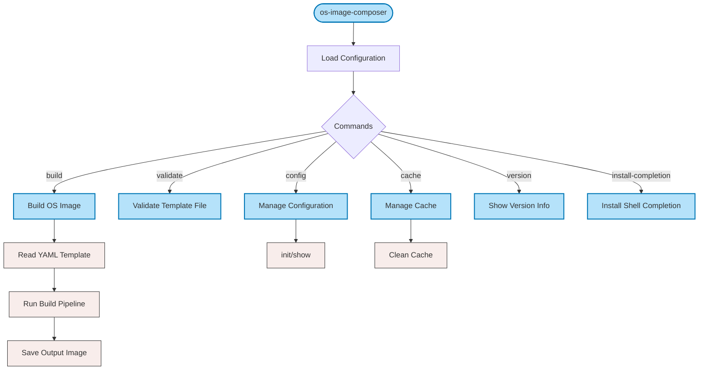

# OS Image Composer CLI Specification

## Table of Contents

- [OS Image Composer CLI Specification](#os-image-composer-cli-specification)
  - [Table of Contents](#table-of-contents)
  - [Overview](#overview)
  - [CLI Flow](#cli-flow)
  - [Usage](#usage)
  - [Global Options](#global-options)
  - [Commands](#commands)
    - [Build Command](#build-command)
    - [Validate Command](#validate-command)
    - [Inspect Command](#inspect-command)
    - [Compare Command](#compare-command)
    - [Cache Command](#cache-command)
      - [cache clean](#cache-clean)
    - [Config Command](#config-command)
      - [config init](#config-init)
      - [config show](#config-show)
    - [Version Command](#version-command)
    - [Install-Completion Command](#install-completion-command)
  - [Examples](#examples)
    - [Building an Image](#building-an-image)
    - [Managing Configuration](#managing-configuration)
    - [Managing Cache](#managing-cache)
    - [Inspecting and Comparing Images](#inspecting-and-comparing-images)
    - [Validating Templates](#validating-templates)
  - [Configuration Files](#configuration-files)
    - [Global Configuration File](#global-configuration-file)
    - [Image Template File](#image-template-file)
  - [Exit Codes](#exit-codes)
  - [Troubleshooting](#troubleshooting)
    - [Common Issues](#common-issues)
    - [Logging](#logging)
  - [Related Documentation](#related-documentation)

## Overview

`os-image-composer` is a command-line tool for generating custom images for
different operating systems, including
[Azure Linux](https://github.com/microsoft/azurelinux),
[Wind River eLxr](https://www.windriver.com/blog/Introducing-eLxr), and
[Edge Microvisor Toolkit](https://github.com/open-edge-platform/edge-microvisor-toolkit).
The tool provides a flexible approach to creating and configuring
production-ready OS images with precise customization.

OS Image Composer uses a single CLI with subcommands to deliver a consistent
user experience while maintaining flexibility. The tool's architecture is built
around the following files:

1. A global configuration file that defines system-wide settings like cache
   locations and provider configurations
2. Image template files in YAML format that define per-image build requirements

The tool follows a staged build process to support package caching, image
caching, and various customization options that speed up development cycles and
ensure reproducible builds.

## CLI Flow

The following diagram illustrates the high-level flow of the OS Image Composer
CLI, the commands of which begin with `os-image-composer`:



The primary workflow is through the `build` command, which reads an image
template file and runs the build pipeline to create a new image.

See also:

- [Build Stages](./os-image-composer-build-process.md#build-stages-in-detail)
  for the stages of the build pipeline

## Usage

```bash
os-image-composer [global options] command [command options] [arguments...]
```

## Global Options

The OS Image Composer command-line utility uses a layered configuration approach,
with command-line options taking priority over the configuration file settings:

| Option | Description |
| ------ | ----------- |
| `--config FILE` | Global configuration file. This file contains system-wide settings that apply to all image builds. If not specified, the tool searches for configuration files in standard locations. |
| `--log-level LEVEL` | Log level: debug, info, warn, error (overrides config). Use debug for troubleshooting build issues. |
| `--log-file PATH` | Tee logs to a specific file path (overrides `logging.file` in the configuration). |
| `--help, -h` | Show help for any command or subcommand. |
| `--version` | Show `os-image-composer` version information. |

## Commands

### Build Command

Build an OS image from an image template file. This is the primary command for
creating custom OS images according to your requirements.

```bash
os-image-composer build [flags] TEMPLATE_FILE
```

**Arguments:**

- `TEMPLATE_FILE` - Path to the YAML image template file (required)

**Flags:**

| Flag | Description |
| ---- | ----------- |
| `--workers, -w INT` | Number of concurrent download workers (overrides config). |
| `--cache-dir, -d DIR` | Package cache directory (overrides config). Proper caching significantly improves build times. |
| `--work-dir DIR` | Working directory for builds (overrides config). This directory is where images are constructed before being finalized. |
| `--verbose, -v` | Enable verbose output (equivalent to --log-level debug). Displays detailed information about each step of the build process. |
| `--dotfile, -f FILE` | Generate a dot file for the merged template dependency graph (user + defaults with resolved packages). |
| `--system-packages-only` | When paired with `--dotfile`, limit the dependency graph to roots defined in `SystemConfig.Packages`. Dependencies pulled in by those roots still appear, but essentials/kernel/bootloader packages aren't drawn unless required by a system package. |

**Example:**

```bash
# Build an image with default settings
sudo -E os-image-composer build my-image-template.yml

# Build with custom workers and cache directory
sudo -E os-image-composer build --workers 16 --cache-dir /tmp/cache my-image-template.yml

# Build with verbose output
sudo -E os-image-composer build --verbose my-image-template.yml

# Build and generate dependency graphs
sudo -E os-image-composer build --dotfile deps.dot my-image-template.yml
# Limit the graph to SystemConfig.Packages roots
sudo -E os-image-composer build --dotfile system.dot --system-packages-only my-image-template.yml
```

**Note:** The build command typically requires sudo privileges for operations like creating loopback devices and mounting filesystems.

See also:

- [Build Stages in Detail](./os-image-composer-build-process.md#build-stages-in-detail) for information about each build stage
- [Build Performance Optimization](./os-image-composer-build-process.md#build-performance-optimization) for tips to improve build speed

### Validate Command

Validate an image template file without building it. This allows checking for
errors in your template before committing to a full build process.

```bash
os-image-composer validate TEMPLATE_FILE
```

**Arguments:**

- `TEMPLATE_FILE` - Path to the YAML image template file to validate (required)

**Description:**

The validate command performs the following checks:

- YAML syntax validation
- Schema validation against the image template JSON schema
- Required fields verification
- Type checking for all fields

**Example:**

```bash
# Validate a template file
os-image-composer validate my-image-template.yml

# Validate with verbose output
os-image-composer --log-level debug validate my-image-template.yml
```

See also:

- [Validate Stage](./os-image-composer-build-process.md#1-validate-stage)
  for details on the validation process

### Inspect Command

Inspects a raw image and outputs comprehensive details about the image including partition
table layout, partition identity and attributes, filesystem information, bootloader details, and layout diagnostics.

```bash
os-image-composer inspect [flags] IMAGE_FILE
```

**Arguments:**

- `IMAGE_FILE` - Path to the RAW image file to inspect (required)

**Flags:**

| Flag | Description |
| ---- | ----------- |
| `--format STRING` | Output format: `text`, `json`, or `yaml` (default: `text`) |
| `--pretty` | Pretty-print JSON output (only for `--format=json`; default: `false`) |

**Description:**

The inspect command extracts and analyzes the following from a disk image:

**Partition Table:**

- Type (GPT/MBR) and sector sizes
- For GPT: disk GUID and protective MBR status
- Layout diagnostics: largest unallocated free span and misaligned partitions (detected against physical sector size and 1 MiB alignment)

**Partitions:**

- Index, name, type/GUID, start/end LBA, and size
- For GPT: partition GUID and decoded attribute bits (required, legacy BIOS bootable, read-only)
- Filesystem type, label, and UUID
- EFI/UKI evidence (if present on ESP/VFAT partitions)

**Bootloader & Secure Boot:**

- EFI binaries: kind, architecture, signature status, SBAT
- UKI payloads: kernel/initrd/OS-release hashes and metadata

**Output Formats:**

- `text`: Human-readable summary with tables and structured sections
- `json`: Complete structured data suitable for automation and comparison
- `yaml`: YAML representation of the image summary

**Example:**

```bash
# Inspect a raw image and output text (default)
os-image-composer inspect my-image.raw

# Inspect and output pretty JSON
os-image-composer inspect --format=json --pretty my-image.raw

# Inspect and output YAML
os-image-composer inspect --format=yaml my-image.raw
```

### Compare Command

Compares two disk images and outputs detailed differences in partition layout, filesystems, bootloaders, and EFI/UKI payloads.

```bash
os-image-composer compare [flags] IMAGE_FILE1 IMAGE_FILE2
```

**Arguments:**

- `IMAGE_FILE1` - Path to the first RAW image file (required)
- `IMAGE_FILE2` - Path to the second RAW image file (required)

**Flags:**

| Flag | Description |
| ---- | ----------- |
| `--format STRING` | Output format: `text` or `json` (default: `text`) |
| `--mode STRING` | Compare mode: `diff` (partition/FS changes), `summary` (high-level counts), or `full` (complete image metadata). Default: `diff` for text, `full` for JSON |
| `--pretty` | Pretty-print JSON output (only for `--format=json`; default: `false`) |
| `--hash-images` | Perform image hashing for verifying binary identical image (default `false`) |

**Description:**

The compare command performs a deep structural comparison of two images and reports:

**Partition Table Changes:**

- Disk GUID changes (GPT)
- Partition table type or sector size changes
- Free space layout changes (largest unallocated extent)
- Misaligned partition detection changes

**Partition Changes:**

- Added/removed partitions (detected by GUID for GPT, by LBA range for MBR)
- Modified partitions: changes to name, GUID, LBA range, size, or GPT attribute bits
- Filesystem changes: type, label, UUID modifications
- Per-partition EFI binary changes (path, kind, architecture, signature status)

**Global EFI/UKI Changes:**

- Added/removed EFI binaries across all partitions
- Modified EFI binaries: SHA256, signature status, bootloader kind
- UKI payload changes: kernel, initrd, OS-release, and section SHA256s

**Compare Modes:**

- `diff`: Detailed changes (partitions, filesystems, EFI binaries)
- `summary`: High-level counts (added, removed, modified counts)
- `full`: Complete image metadata plus all diffs

**Output:**

- Text format provides human-readable sections with tables and field-by-field diffs
- JSON format includes complete structured data for scripting and tooling
- Exit code is 0 if images are equal, 1 if differences found

**Example:**

```bash
# Compare two images and show detailed text diff
os-image-composer compare image-v1.raw image-v2.raw

# Show only a summary of changes
os-image-composer compare --mode=summary image-v1.raw image-v2.raw

# Compare and output pretty JSON with full metadata
os-image-composer compare --format=json --mode=full --pretty image-v1.raw image-v2.raw

# Compact JSON diff suitable for CI/CD automation
os-image-composer compare --format=json --mode=diff image-v1.raw image-v2.raw

# Perform comparison with image hashing enabled with details text diff
os-image-composer compare --hash-images=true image-v1.raw image-v2.raw
```

### Cache Command

Manage cached artifacts created during the build process.

```bash
os-image-composer cache SUBCOMMAND
```

#### cache clean

Remove cached packages or workspace chroot data.

```bash
os-image-composer cache clean [flags]
```

**Flags:**

| Flag | Description |
| ---- | ----------- |
| `--packages` | Remove cached packages (default when no scope flags are provided). |
| `--workspace` | Remove cached chroot environments and chroot tarballs under the workspace directory. |
| `--all` | Enable both package and workspace cleanup in a single invocation. |
| `--provider-id STRING` | Restrict cleanup to a specific provider (format: `os-dist-arch`). |
| `--dry-run` | Show what would be removed without deleting anything. |

**Examples:**

```bash
# Remove all cached packages
os-image-composer cache clean

# Remove chroot caches for a single provider
os-image-composer cache clean --workspace --provider-id azure-linux-azl3-x86_64

# Preview everything that would be deleted
os-image-composer cache clean --all --dry-run
```

When no scope flag is supplied, the command defaults to `--packages`.

### Config Command

Manage the global configuration file. The config command provides subcommands
for initializing and viewing configuration.

```bash
os-image-composer config SUBCOMMAND
```

**Subcommands:**

#### config init

Initialize a new configuration file with default values.

```bash
os-image-composer config init [CONFIG_FILE]
```

**Arguments:**

- `CONFIG_FILE` - Path where the configuration file should be created (optional). If not specified, creates the configuration in a standard location.

**Example:**

```bash
# Initialize configuration in current directory
os-image-composer config init os-image-composer.yml

# Initialize in default location
os-image-composer config init
```

#### config show

Show the current configuration settings.

```bash
os-image-composer config show
```

**Example:**

```bash
# Show current configuration
os-image-composer config show

# Show configuration from specific file
os-image-composer --config /path/to/config.yml config show
```

### Version Command

Display the tool's version information, including build date, Git commit SHA, and organization.

```bash
os-image-composer version
```

**Example:**

```bash
os-image-composer version
```

**Output includes:**

- Version number
- Build date
- Git commit SHA
- Organization

### Install-Completion Command

Install shell completion for the os-image-composer command. Supports bash, zsh, fish, and PowerShell.

```bash
os-image-composer install-completion [flags]
```

**Flags:**

| Flag | Description |
| ---- | ----------- |
| `--shell STRING` | Shell type (bash, zsh, fish, powershell). If not specified, auto-detects current shell. |
| `--force` | Force overwrite existing completion files. |

**Example:**

```bash
# Auto-detect shell and install completion
os-image-composer install-completion

# Install completion for specific shell
os-image-composer install-completion --shell bash

# Force reinstall
os-image-composer install-completion --force
```

**Post-Installation Steps:**

After installing completion, you need to reload your shell configuration:

**Bash:**

```bash
echo "source ~/.bash_completion.d/os-image-composer.bash" >> ~/.bashrc
source ~/.bashrc
```

**Zsh:**

```zsh
echo 'fpath=(~/.zsh/completion $fpath)' >> ~/.zshrc
source ~/.zshrc
```

**Fish:**
Fish automatically loads completions from the standard location. Just restart your terminal.

**PowerShell:**

```powershell
Set-ExecutionPolicy -ExecutionPolicy RemoteSigned -Scope CurrentUser
. $PROFILE
```

## Examples

### Building an Image

```bash
# Build an image with default settings
sudo -E os-image-composer build image-templates/azl3-x86_64-edge-raw.yml

# Build with custom configuration
sudo -E os-image-composer --config=/path/to/config.yaml build image-templates/azl3-x86_64-edge-raw.yml

# Build with custom workers and cache
sudo -E os-image-composer build --workers 12 --cache-dir ./package-cache image-templates/azl3-x86_64-edge-raw.yml

# Build with debug logging
sudo -E os-image-composer --log-level debug build image-templates/azl3-x86_64-edge-raw.yml
```

### Managing Configuration

```bash
# Initialize a new configuration file
os-image-composer config init my-config.yml

# Show current configuration
os-image-composer config show

# Use a specific configuration file
os-image-composer --config /etc/os-image-composer/config.yml build template.yml
```

### Managing Cache

```bash
# Remove all cached packages
os-image-composer cache clean

# Remove workspace chroot caches for a specific provider
os-image-composer cache clean --workspace --provider-id azure-linux-azl3-x86_64

# Preview both package and workspace cleanup without deleting files
os-image-composer cache clean --all --dry-run
```

### Inspecting and Comparing Images

```bash
# Inspect an image in text format
os-image-composer inspect my-image.raw

# Inspect and output JSON (suitable for tooling/CI)
os-image-composer inspect --format=json --pretty my-image.raw

# Compare two images with detailed diff
os-image-composer compare image-v1.raw image-v2.raw

# Compare with JSON output for parsing
os-image-composer compare --format=json --mode=diff image-v1.raw image-v2.raw
```

### Validating Templates

```bash
# Validate a template
os-image-composer validate image-templates/azl3-x86_64-edge-raw.yml

# Validate with debug output
os-image-composer --log-level debug validate image-templates/azl3-x86_64-edge-raw.yml
```

## Configuration Files

### Global Configuration File

The global configuration file (YAML format) defines system-wide settings that
apply to all image builds. The tool searches for configuration files in the following locations (in order):

1. Path specified with `--config` flag
2. `os-image-composer.yml` in current directory
3. `.os-image-composer.yml` in current directory
4. `os-image-composer.yaml` in current directory
5. `.os-image-composer.yaml` in current directory
6. `~/.os-image-composer/config.yml`
7. `~/.os-image-composer/config.yaml`
8. `~/.config/os-image-composer/config.yml`
9. `~/.config/os-image-composer/config.yaml`
10. `/etc/os-image-composer/config.yml`
11. `/etc/os-image-composer/config.yaml`

**Example Configuration:**

```yaml
# Number of concurrent workers for package downloads
workers: 8

# Directory for caching downloaded packages
cache_dir: "./cache"

# Working directory for build process
work_dir: "./workspace"

# Configuration files directory
config_dir: "./config"

# Temporary directory
temp_dir: "/tmp"

# Logging configuration
logging:
  level: "info"  # debug, info, warn, error
```

**Configuration Fields:**

| Field | Type | Description |
| ----- | ---- | ----------- |
| `workers` | integer | Number of concurrent download workers (1-100). Default: 8 |
| `cache_dir` | string | Directory for package cache. Default: "./cache" |
| `work_dir` | string | Working directory for builds. Default: "./workspace" |
| `config_dir` | string | Directory for configuration files. Default: "./config" |
| `temp_dir` | string | Temporary directory. Default: system temp directory |
| `logging.level` | string | Log level (debug/info/warn/error). Default: "info" |

### Image Template File

The image template file (YAML format) defines the specifications for a single image build.
With this file, you can define exactly what goes into your custom OS image,
including packages, configurations, and customizations.

**Example Template:**

```yaml
image:
  # Basic image identification
  name: edge-device-image                    # Name of the resulting image
  version: "1.2.0"                           # Version for tracking and naming

target:
  # Target OS and image configuration
  os: azure-linux                            # Base operating system
  dist: azl3                                 # Distribution identifier
  arch: x86_64                               # Target architecture
  imageType: raw                             # Output format (supported: raw, iso only)

systemConfig:
  # System configuration
  name: edge                                 # Configuration name
  description: Edge device image with Microvisor support

  # Package configuration
  packages:                                  # Packages to install
    - openssh-server
    - docker-ce
    - vim
    - curl
    - wget

  # Kernel configuration
  kernel:
    version: "6.12"                          # Kernel version to include
    cmdline: "quiet splash"                  # Additional kernel command-line parameters
```

See also:

- [Common Build Patterns](./os-image-composer-build-process.md#common-build-patterns)
  for example image templates
- [Template Structure](./os-image-composer-templates.md#template-structure)
  for detailed template documentation

## Exit Codes

The tool provides consistent exit codes that can be used in scripting and
automation:

| Code | Description |
| ---- | ----------- |
| 0 | Success: The command completed successfully. |
| 1 | General error: An unspecified error occurred during execution. |

## Troubleshooting

### Common Issues

1. **Disk Space**: Building images requires significant temporary disk space.

   ```bash
   # Check free space in workspace directory
   df -h ./workspace
   
   # Check free space in cache directory
   df -h ./cache
   ```

2. **Permissions**: The build command requires sudo privileges.

   ```bash
   # Run with sudo and preserve environment
   sudo -E os-image-composer build template.yml
   ```

3. **Configuration Issues**: Verify configuration is valid.

   ```bash
   # Show current configuration
   os-image-composer config show
   
   # Initialize with defaults
   os-image-composer config init
   ```

4. **Template Validation Errors**: Validate templates before building.

   ```bash
   # Validate template
   os-image-composer validate template.yml
   ```

### Logging

Use the `--log-level` flag or `--verbose` flag to get more detailed output:

```bash
# Debug logging
os-image-composer --log-level debug build template.yml

# Verbose output (same as debug)
os-image-composer build --verbose template.yml

# Error logging only
os-image-composer --log-level error build template.yml
```

## Related Documentation

- [Build Process](./os-image-composer-build-process.md) - Detailed information about the build stages
- [Templates](./os-image-composer-templates.md) - Template structure and usage
- [Caching](./os-image-composer-caching.md) - How caching works
- [Coding Style](./os-image-composer-coding-style.md) - Development guidelines
